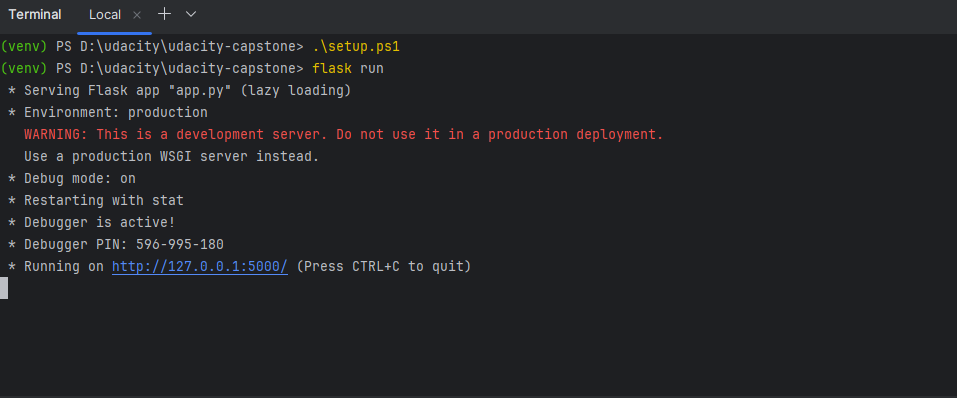
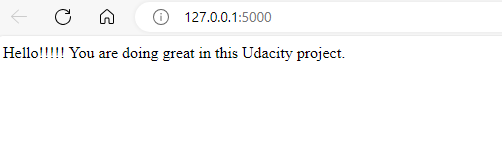

# Capstone Backend

## Getting Started

### Installing Dependencies

#### Python 3.7

Follow instructions to install the latest version of python for your platform in the [python docs](https://docs.python.org/3/using/unix.html#getting-and-installing-the-latest-version-of-python)

#### Virtual Environment

We recommend working within a virtual environment whenever using Python for projects. This keeps your dependencies for each project separate and organized. Instructions for setting up a virtual environment for your platform can be found in the [python docs](https://packaging.python.org/guides/installing-using-pip-and-virtual-environments/)

#### PIP Dependencies

Once you have your virtual environment setup and running, install dependencies by naviging to the `/backend` directory and running:

```bash
pip install -r requirements.txt
```

This will install all the required packages we selected within the `requirements.txt` file.

##### Key Dependencies

- [Flask](http://flask.pocoo.org/) is a lightweight backend microservices framework. Flask is required to handle requests and responses.

- [SQLAlchemy](https://www.sqlalchemy.org/) and [Flask-SQLAlchemy](https://flask-sqlalchemy.palletsprojects.com/en/2.x/) are libraries to handle the lightweight sqlite database. Since we want you to focus on auth, we handle the heavy lift for you in `./src/database/models.py`. We recommend skimming this code first so you know how to interface with the Drink model.

- [jose](https://python-jose.readthedocs.io/en/latest/) JavaScript Object Signing and Encryption for JWTs. Useful for encoding, decoding, and verifying JWTS.

##### Set up the Database

With Postgres running, create a `capstone` database:

```bash
createdb capstone
```

Populate the database using the `capstone.psql` file provided with command

```bash
psql capstone < capstone.psql
```

## Running the server

### Set up the environment variables

```bash
chmod +x setup.sh
source setup.sh
```

Windows (Powershell):
```bash
./setup.ps1
```

Change the `DATABASE_URL`, `AUTH0_DOMAIN` and `API_AUDIENCE` in the `.env` file to reflect your environment.

### Run the app

The hosted version is at https://udacity-capstone.onrender.com/

This application can be run locally with command:

```bash
flask run
```
If the command runs successfully, you can view the output at http://127.0.0.1:5000/





## API Documents

### Roles
- Casting Assistant
  - Can view actors, movies and casts
- Casting Director
  - All permissions a Casting Assistant has
  - Add or delete an actor from the database
  - Modify actors or movies
  - Add, modify and delete a cast from the database
- Executive Producer
  - All permissions a Casting Director has
  - Add or delete a movie from the database
### Permission matrix
&nbsp; | Casting Assistant | Casting Director | Executive Producer 
--- | --- | --- | ---
`get:actors` | &check; | &check; | &check;
`post:actors` |  | &check; | &check;
`patch:actors` |  | &check; | &check;
`delete:actors` |  | &check; | &check;
`get:movies` | &check; | &check; | &check;
`post:movies` |  |  | &check;
`patch:movies` |  | &check; | &check;
`delete:movies` |  |  | &check;
`get:casts` | &check; | &check; | &check;
`post:casts` |  | &check; | &check;
`patch:casts` |  | &check; | &check;
`delete:casts` |  | &check; | &check;

Use the following link to generate access token for the api call

`https://{{AUTH0_DOMAIN}}/authorize?audience={{API_AUDIENCE}}&response_type=token&client_id={{CLIENT_ID}}&redirect_uri={{CALLBACK_URI}}`

Eg:
- `AUTH0_DOMAIN` = `dev-uizy8vy4polqae3g.us.auth0.com`
- `API_AUDIENCE` = `capstone-app`
- `CLIENT_ID` = `HJHaoCcSdyUbdqLo3cvUSxXsdWmHvOrC`
- `CALLBACK_URI` = `https://127.0.0.1:5000/callback`

### Endpoints

`GET '/api/actors'`

- Fetches a list of actors
- Request Arguments: None
- Returns: An object with a success flag and a list of actors

```json
{
    "actors": [
        {
            "age": 41,
            "gender": "n/a",
            "id": 1,
            "name": "Lee Gleichner"
        },
        {
            "age": 43,
            "gender": "male",
            "id": 2,
            "name": "Toby Christiansen II"
        }
    ],
    "success": true
}
```

`POST '/api/actors'`

- Creates an actor
- Request Body:
```json
{
    "name": "Monica Schamberger",
    "age": 45,
    "gender": "female"
}
```
- Returns: An object with a success flag and the created actor

```json
{
    "actor": {
        "age": 45,
        "gender": "female",
        "id": 7,
        "name": "Monica Schamberger"
    },
    "success": true
}
```

`PATCH '/api/actors/${id}'`

- Update the existing actor
- Request Arguments:
  - `int: id` : the actor id
- Request Body:
```json
{
    "name": "Monica Schamberger 2",
    "age": 23,
    "gender": "male"
}
```
- Returns: An object with a success flag and the updated actor

```json
{
    "actor": {
        "age": 23,
        "gender": "male",
        "id": 7,
        "name": "Monica Schamberger 2"
    },
    "success": true
}
```

`DELETE '/api/actors/${id}'`

- Delete the existing actor
- Request Arguments:
  - `int: id` : the actor id
- Returns: An object with a success flag and the deleted actor

```json
{
    "actor": {
        "age": 23,
        "gender": "male",
        "id": 7,
        "name": "Monica Schamberger 2"
    },
    "success": true
}
```

`GET '/api/movies'`

- Fetches a list of movies
- Request Arguments: None
- Returns: An object with a success flag and a list of movies

```json
{
    "movies": [
        {
            "id": 2,
            "release_date": "2024-03-23T07:17:59.671000Z",
            "title": "Sed error consequuntur."
        },
        {
            "id": 1,
            "release_date": "2024-03-26T07:16:58.125000Z",
            "title": "Enim molestiae rerum et."
        }
    ],
    "success": true
}
```

`POST '/api/movies'`

- Creates a movie
- Request Body:
```json
{
    "title": "Ipsum rerum fugit voluptas provident qui sit id omnis.",
    "release_date": "2024-03-23T07:42:22.444000Z"
}
```
- Returns: An object with a success flag and the created movie

```json
{
    "movie": {
        "id": 3,
        "release_date": "2024-03-23T07:42:22.444000Z",
        "title": "Ipsum rerum fugit voluptas provident qui sit id omnis."
    },
    "success": true
}
```

`PATCH '/api/movies/${id}'`

- Update the existing movie
- Request Arguments:
  - `int: id` : the movie id
- Request Body:
```json
{
    "title": "Ipsum rerum fugit voluptas provident qui sit id omnis. 2",
    "release_date": "2024-04-23T07:42:22.444000Z"
}
```
- Returns: An object with a success flag and the updated movie

```json
{
    "movie": {
        "id": 3,
        "release_date": "2024-04-23T07:42:22.444000Z",
        "title": "Ipsum rerum fugit voluptas provident qui sit id omnis. 2"
    },
    "success": true
}
```

`DELETE '/api/movies/${id}'`

- Delete the existing movie
- Request Arguments:
  - `int: id` : the movie id
- Returns: An object with a success flag and the deleted movie

```json
{
    "movie": {
        "id": 3,
        "release_date": "2024-04-23T07:42:22.444000Z",
        "title": "Ipsum rerum fugit voluptas provident qui sit id omnis. 2"
    },
    "success": true
}
```

## Testing

To deploy the tests, run

```bash
dropdb capstone_test
createdb capstone_test
psql capstone_test < capstone.psql
python test_app.py
```
